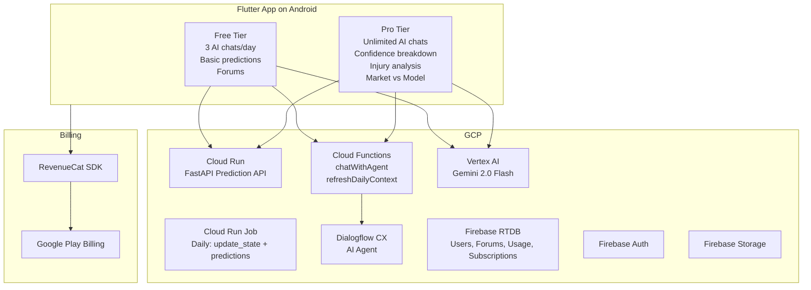

# Signal Sports -- Google Play Store Launch Plan (1 Week)

## Architecture Overview




---

## Day 1-2: Fix AI Chat + Implement Free/Pro Tier Logic

### 1. Fix the AI Chat Usage Tracking Bug

The current system has two parallel AI services that are not properly coordinated:

- `[ai_chat_service.dart](app/lib/Services/ai_chat_service.dart)` -- Vertex AI Gemini streaming (actually sends messages)
- `[agent_chat_service.dart](app/lib/Services/agent_chat_service.dart)` -- Dialogflow CX via Cloud Functions (tracks usage)
- `[ai_chat_provider.dart](app/lib/Providers/ai_chat_provider.dart)` -- Uses `AIChatService` for streaming but `AgentChatService` for usage tracking

The provider calls `_service.sendMessageStream(text)` (Vertex AI, no usage tracking) but only fetches usage from the Dialogflow agent service. The Vertex AI path never increments the usage counter, so the count is wrong.

**Fix:** Move usage tracking into a shared layer. Either:

- (A) Track usage client-side in Firebase RTDB directly from the provider (simpler, recommended for speed), or
- (B) Route all messages through the Cloud Function (more secure but slower)

Recommendation: **(A)** -- increment `usage/$uid/$today` in RTDB from the `AIChatNotifier` after each successful Vertex AI response, and read that count on init. Remove the Dialogflow CX dependency from chat entirely (it adds latency and is redundant with Vertex AI).

### 2. Change Free Tier to 3 Chats/Day

- Update `DAILY_FREE_CHAT_LIMIT` in `[functions/index.js](functions/index.js)` from `10` to `3`
- Update `dailyLimit` in `[agent_chat_service.dart](app/lib/Services/agent_chat_service.dart)` from `10` to `3`
- Update `AIChatState.dailyLimit` to `3`
- Update the locked state text in `[ai_chat_widget.dart](app/lib/Widgets/ai_chat_widget.dart)` from "10 free chats" to "3 free chats"

### 3. Add Subscription Status to User Model

Add a `subscriptionTier` field to `[user_profile.dart](app/lib/Models/user_profile.dart)`:

```dart
final String subscriptionTier; // 'free' or 'pro'
final DateTime? subscriptionExpiry;
```

Store subscription status in Firebase RTDB at `users/$uid/subscription`. RevenueCat webhooks will update this server-side.

### 4. Gate Features Based on Tier

**Features behind the Pro paywall (existing features to gate):**

| Feature | Free | Pro |

|---------|------|-----|

| AI Chat ("Signal") | 3/day | Unlimited |

| Basic predictions (favored team, win %) | Yes | Yes |

| Confidence Score breakdown (expandable factors in `[game_detail_screen.dart](app/lib/Screens/game_detail_screen.dart)` `_ConfidenceScoreIndicator`) | Locked | Yes |

| Injury impact analysis (detailed per-player list) | Locked | Yes |

| Forums (global + per-game) | Yes | Yes |

| Profile, followers, social features | Yes | Yes |

| Live game tracking | Yes | Yes |

| Quick AI game narrative (one-shot analysis) | Locked | Yes |

| Ad-free experience | N/A (no ads yet) | Yes (future) |

---

## Day 3: Subscription System (RevenueCat)

RevenueCat is the right choice for a 1-week timeline:

- Free up to $2.5K/month revenue
- Handles Google Play Billing complexity
- Has a Flutter SDK (`purchases_flutter`)
- Server-side receipt validation
- Webhooks to update Firebase RTDB subscription status

### Pricing

- **Signal Pro Monthly:** $4.99/month
- **Signal Pro Annual:** $29.99/year (save 50%)

### Implementation

1. Create a RevenueCat account and set up a Google Play project
2. Add `purchases_flutter` to `[pubspec.yaml](app/pubspec.yaml)`
3. Create a `SubscriptionService` in `app/lib/Services/`
4. Create a `PaywallScreen` (upgrade screen shown when free limit hit or locked feature tapped)
5. Create a `SubscriptionProvider` using Riverpod
6. Wire the "Upgrade to Pro" button in `[ai_chat_widget.dart](app/lib/Widgets/ai_chat_widget.dart)` (currently a TODO placeholder) to navigate to the paywall

---

## Day 4: Redesign AI Chat Widget (Branded as "Signal")

Rename the AI assistant from "AI INSIGHTS" to **"Signal"** throughout the app.

Key design improvements for `[ai_chat_widget.dart](app/lib/Widgets/ai_chat_widget.dart)`:

- Replace generic "AI INSIGHTS" header with "Signal" branding and a distinctive avatar
- Full-screen chat mode (not just a collapsible 440px box)
- Better message bubbles with timestamp and read indicators
- Richer quick-action chips (3-4 contextual suggestions)
- Markdown rendering in responses (bold, bullet points, headers)
- Premium badge on the header showing "PRO" for subscribers
- Smoother typing indicator animation
- Input area with attachment/context awareness

**An HTML mockup will be created at** `app/mockup/signal_chat_mockup.html` for your review before Flutter implementation.

---

## Day 5: Migrate API from Render to GCP Cloud Run + Daily Job

### Why move to Cloud Run

- Render free tier sleeps after 15 min of inactivity (cold starts = bad UX)
- All other infra is already on GCP
- Cloud Run with min 1 instance = always warm, ~$5-15/month
- Same network as Firebase RTDB, lower latency

### Steps

1. **Create a Dockerfile** for the FastAPI prediction API:

```dockerfile
FROM python:3.11-slim
WORKDIR /app
COPY requirements.txt .
RUN pip install --no-cache-dir -r requirements.txt
COPY src/ src/
COPY models/ models/
COPY state/ state/
COPY data/ data/
CMD ["uvicorn", "src.api.main:app", "--host", "0.0.0.0", "--port", "8080"]
```

1. **Deploy to Cloud Run** via `gcloud run deploy`
2. **Update** `RENDER_API_URL` in Cloud Functions env to point to the new Cloud Run URL
3. **Update** `app_config.dart` API base URL

### Daily Scripts as Cloud Run Job

Create a second Dockerfile/script that runs:

1. `python src/update_state.py` (update Elo ratings with yesterday's results)
2. `python src/daily_predictions.py --output predictions/daily.json --app-format` (generate today's predictions)

Deploy as a **Cloud Run Job** triggered by **Cloud Scheduler** at 9 AM ET daily (before `refreshDailyContext` Cloud Function runs at the same time).

---

## Day 5-6: Google Play Store Preparation

### Android App Configuration

1. **Change application ID** from `com.example.app` in `[build.gradle.kts](app/android/app/build.gradle.kts)` to something like `com.signalsports.app`
2. **Create a release signing keystore** (`keytool -genkey ...`) and configure `signingConfigs` in Gradle
3. **Set `minSdk`** appropriately (currently `flutter.minSdkVersion` which is 21 -- fine)
4. **Update** `namespace` from `com.example.app` to match new application ID
5. **Remove** leftover git tutorial comments from `[main.dart](app/lib/main.dart)`

### Play Store Requirements

- **Google Play Developer Account:** $25 one-time fee -- register at [play.google.com/console](https://play.google.com/console)
- **Privacy Policy:** Required. Create and host a simple page (can use Firebase Hosting)
- **App Icon:** Ensure 512x512 high-res icon is ready
- **Feature Graphic:** 1024x500 banner image
- **Screenshots:** At least 2 phone screenshots (can use Android emulator)
- **App Description:** Short (80 char) and full (4000 char) descriptions
- **Content Rating:** Complete the IARC questionnaire in Play Console
- **Data Safety Form:** Declare what data is collected (email, profile photo, usage data)

### Do NOT Migrate to Firestore

Keep Firebase Realtime Database for this launch. Reasons:

- 1 week is too tight for a DB migration
- RTDB handles all current use cases (users, forums, notifications, usage tracking)
- Migration risk outweighs benefits right now
- Can be done in v2 post-launch

---

## Day 7: Testing and Submission

1. **Build release APK/AAB:** `flutter build appbundle --release`
2. **Test subscription flow** end-to-end with Google Play test tracks
3. **Test AI chat** with 3-chat limit and upgrade flow
4. **Test paywalled features** show lock state for free users
5. **Submit to Play Store** via internal testing track first, then production
6. **Play Store review** typically takes 1-3 days for new apps

---

## Maximizing Free GCP Credits (Student Edition)

Since you are a student, you have access to significantly more free credits than a typical developer. Here is every program you should apply to, in order of impact:

### Tier 1: Immediate (Do Today)

**1. GCP Free Trial -- $300 credit (90 days)**

- Apply at: [console.cloud.google.com/freetrial](https://console.cloud.google.com/freetrial)
- Automatic approval, no application needed
- Check your GCP Console > Billing to see if you still have trial credit remaining
- If your account already exhausted the trial, create a new GCP project under a fresh Google account (e.g. your .edu email) to get another $300

**2. GitHub Student Developer Pack -- includes GCP credits**

- Apply at: [education.github.com/pack](https://education.github.com/pack)
- Requires proof of enrollment (student ID, .edu email, or enrollment letter)
- Includes Google Cloud credits (historically $50-100) plus tons of other tools
- Also gives you free domain names (Namecheap), CI/CD (GitHub Actions), and more

### Tier 2: Apply This Week (1-3 day approval)

**3. Google for Startups Cloud Program -- up to $100,000+ in credits (2 years)**

- Apply at: [cloud.google.com/startup](https://cloud.google.com/startup)
- **This is the single biggest credit opportunity**
- Self-funded / bootstrapped startups ARE eligible (you do not need VC backing)
- Requirements: have a working product/prototype (you do!), a website/landing page, and be building on GCP
- Credits are valid for 2 years and cover ALL GCP products including Vertex AI, Cloud Run, Firebase (Blaze plan), etc.
- Also includes Google Cloud technical support and mentorship
- Tip: In your application, emphasize that you are an AI-powered sports prediction app launching on Google Play, using Vertex AI/Gemini, Dialogflow CX, Cloud Run, and Firebase. Mention the student angle.

**4. Google Cloud for Education (via your university)**

- Check if your university has a Google Cloud partnership
- Many universities provide students with GCP credits through coursework or lab access
- Ask your CS department or IT department about "Google Cloud Education Credits"
- Some schools provide $50-$300 in credits per student per semester

### Tier 3: Ongoing Free Usage (Always Free)

**5. Firebase Spark/Blaze Free Tier Limits**

- These are perpetual and never expire:
  - Authentication: 10K verifications/month (SMS), unlimited email/password
  - Realtime Database: 1 GB stored, 10 GB/month downloaded
  - Cloud Functions: 2M invocations/month, 400K GB-seconds
  - Cloud Storage: 5 GB stored
  - Hosting: 10 GB stored, 360 MB/day transferred

**6. GCP Always-Free Tier Products**

- Cloud Run: 2M requests/month, 360K vCPU-seconds, 180K GiB-seconds
- Artifact Registry: 500 MB storage
- Cloud Build: 120 build-minutes/day
- Secret Manager: 6 active secret versions
- Vertex AI: Free tier for Gemini API calls (check current quotas in console)

### Application Action Items (Do All of These)

| Program | URL | Expected Credits | Time to Approve |

|---------|-----|-----------------|-----------------|

| GCP Free Trial | console.cloud.google.com/freetrial | $300 | Instant |

| GitHub Student Pack | education.github.com/pack | $50-100 + extras | 1-7 days |

| Google for Startups | cloud.google.com/startup | Up to $100K+ | 1-2 weeks |

| University Credits | Ask your CS/IT department | $50-300 | Varies |

| Firebase Free Tier | Already active | Perpetual free limits | N/A |

| GCP Always-Free | Already active | Perpetual free limits | N/A |

**Total potential: $300 (immediate) + up to $100K+ (startups program) + $50-300 (education) + perpetual free tiers**

### Tips to Maximize Approval for Google for Startups

When filling out the application at cloud.google.com/startup:

1. **Company/project name:** Signal Sports (or your preferred brand name)
2. **Description:** "AI-powered NBA game prediction and analysis platform using Vertex AI, Dialogflow CX, and Firebase, launching on Google Play Store"
3. **Stage:** Pre-revenue / MVP (honest about being a student project launching commercially)
4. **GCP usage:** List all services: Vertex AI (Gemini 2.0 Flash), Dialogflow CX, Cloud Run, Cloud Functions, Firebase Auth, Firebase RTDB, Cloud Storage, Cloud Scheduler
5. **Website:** You will need a landing page -- can quickly deploy one to Firebase Hosting
6. **Team size:** 1 (solo founder is fine)
7. **Funding:** Self-funded / bootstrapped

---

## Summary of Key Decisions

| Decision | Recommendation |

|----------|---------------|

| Hosting | Move from Render to **GCP Cloud Run** |

| Database | **Keep Realtime Database** (do NOT migrate to Firestore) |

| Subscriptions | **RevenueCat** ($4.99/mo, $29.99/yr) |

| AI Agent Name | **"Signal"** |

| Free tier | 3 AI chats/day, basic predictions, forums |

| Daily scripts | **Cloud Run Job** + Cloud Scheduler |

| Chat bug fix | Unify on Vertex AI streaming, track usage in RTDB directly |